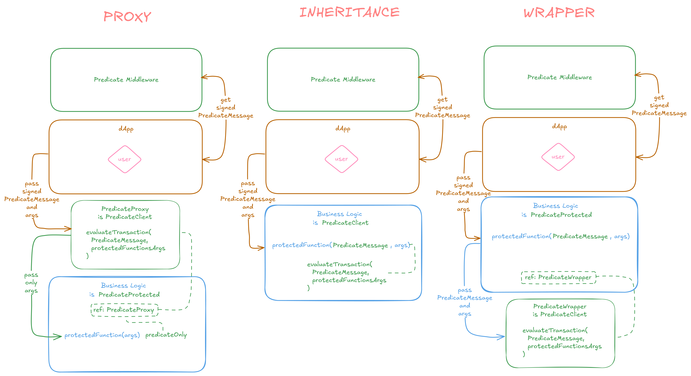

# Predicate Contract Integration Examples

This directory contains example implementations demonstrating different patterns for integrating Predicate in your smart contracts. Each pattern offers a different approach with its own trade-offs in terms of complexity, gas efficiency, and modularity.

## Integration Patterns Diagram

The diagram above illustrates the three integration patterns and their interaction flows:
- **Proxy Pattern**: Uses a dedicated PredicateProxy contract as an intermediary
- **Inheritance Pattern**: Business logic directly inherits PredicateClient functionality

## Base Contract: MetaCoin

All examples use a simple `MetaCoin` contract as the base implementation. The original contract features:
- A simple token with balances
- Basic transfer functionality 
- Balance checking

## Example Patterns

### 1. Proxy Pattern

**Location:** `src/examples/proxy/`

The Proxy pattern uses a dedicated proxy contract to interact with the main contract on behalf of users.

**Key components:**
- `PredicateClientProxy.sol`: Acts as an intermediary between users and the protected contract
- `PredicateProtected.sol`: Base contract with proxy-related functionality
- `IPredicateProtected.sol`: Interface defining the proxy protection methods
- `MetaCoin.sol`: Main contract with proxy integration

**How it works:**
1. Users interact with the proxy contract instead of directly with the main contract
2. The proxy validates transactions through Predicate before forwarding them
3. The main contract checks that calls come only from the authorized proxy

**Benefits:**
- Clean separation of concerns
- Upgradable validation logic
- Original contract interface remains unchanged to external callers

**Drawbacks:**
- Additional gas costs for proxy deployment and calls
- More complex architecture

### 2. Inheritance Pattern

**Location:** `src/examples/inheritance/`

The Inheritance pattern directly extends the Predicate client functionality through inheritance.

**Key components:**
- `MetaCoin.sol`: Inherits from `PredicateClient` to gain validation capabilities

**How it works:**
1. The contract inherits from `PredicateClient`
2. Protected functions manually call validation methods
3. Business logic is executed only if validation passes

**Benefits:**
- Most direct integration
- Full control over validation flow
- No additional contracts required

**Drawbacks:**
- Tighter coupling between business logic and Predicate validation
- Requires more manual validation code
- May be harder to upgrade validation logic

## Choosing the Right Pattern

- **Use the Inheritance pattern** when you need direct control over the validation process and want to minimize contract dependencies. This is the **recommended approach** for most use cases.
- **Use the Proxy pattern** when you need a clean separation of concerns and potentially upgradable validation logic. This provides maximum flexibility.
- ~~**Wrapper pattern**~~ - **Deprecated in v2**. Use Inheritance or Proxy patterns instead.

Each pattern can be adapted to suit your specific needs and security requirements.
