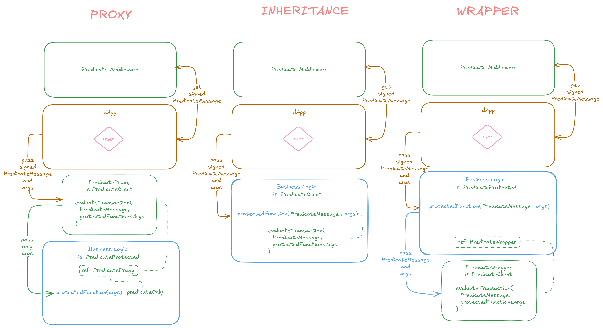

# Predicate Contract Integration Examples

This directory contains example implementations demonstrating different patterns for integrating Predicate in your smart contracts. Each pattern offers a different approach with its own trade-offs in terms of complexity, gas efficiency, and modularity.

## Compliance Types

Predicate supports two complementary compliance approaches:

### Application Compliance
Enforcement via off-chain Predicate attestations validated on-chain. Policies define rules (WHO can act, WHAT they can do, WHEN they can do it), and the application validates attestations before executing transactions.

**Examples:** `inheritance/BasicVault.sol`, `inheritance/AdvancedVault.sol`, `inheritance/MetaCoin.sol`

### Asset Compliance
Enforcement at the asset level. The asset itself (e.g., a token) has built-in compliance controls like account freezing that block certain addresses from interacting with the asset.

**Examples:** `asset-compliance/FreezableToken.sol`

These approaches can be used independently or combined for defense-in-depth.

## Integration Patterns Diagram

The diagram above illustrates the three integration patterns and their interaction flows:
- **Proxy Pattern**: Uses a dedicated PredicateProxy contract as an intermediary
- **Inheritance Pattern**: Business logic directly inherits PredicateClient functionality
- **Wrapper Pattern**: Business logic calls an external PredicateWrapper contract

## Base Contract: MetaCoin

All examples use a simple `MetaCoin` contract as the base implementation. The original contract features:
- A simple token with balances
- Basic transfer functionality 
- Balance checking

## Example Patterns

### 1. Proxy Pattern

**Location:** `src/examples/proxy/`

The Proxy pattern uses a dedicated proxy contract to interact with the main contract on behalf of users.

**Key components:**
- `PredicateClientProxy.sol`: Acts as an intermediary between users and the protected contract
- `PredicateProtected.sol`: Base contract with proxy-related functionality
- `IPredicateProtected.sol`: Interface defining the proxy protection methods
- `MetaCoin.sol`: Main contract with proxy integration

**How it works:**
1. Users interact with the proxy contract instead of directly with the main contract
2. The proxy validates transactions through Predicate before forwarding them
3. The main contract checks that calls come only from the authorized proxy

**Benefits:**
- Clean separation of concerns
- Upgradable validation logic
- Original contract interface remains unchanged to external callers

**Drawbacks:**
- Additional gas costs for proxy deployment and calls
- More complex architecture

### 2. Wrapper Pattern

⚠️ **Status: DEPRECATED IN V2**

**Location:** `src/examples/wrapper/` (not available)

The Wrapper pattern is **not supported in v2**. This pattern was explored in earlier versions but has been deprecated in favor of the simpler and more efficient Inheritance and Proxy patterns.

**Why deprecated:**
- Added unnecessary complexity with external contract calls
- Higher gas costs compared to Inheritance pattern
- Maintenance overhead not justified by benefits
- Inheritance and Proxy patterns cover all practical use cases

**Migration:** If you were using the Wrapper pattern in v1, migrate to:
- **Inheritance Pattern** - For direct integration with minimal gas overhead
- **Proxy Pattern** - For separation of concerns and upgradeability

**Note:** The Wrapper pattern will not be implemented in v2. Please use the **Inheritance Pattern** (recommended for most cases) or **Proxy Pattern** (for separation of concerns).

### 3. Inheritance Pattern

**Location:** `src/examples/inheritance/`

The Inheritance pattern directly extends the Predicate client functionality through inheritance.

**Key components:**
- `MetaCoin.sol`: Inherits from `PredicateClient` to gain validation capabilities
- `PredicateHolding.sol`: Minimal example that holds Predicate configuration without business logic

**How it works:**
1. The contract inherits from `PredicateClient`
2. Protected functions manually call validation methods
3. Business logic is executed only if validation passes

**Benefits:**
- Most direct integration
- Full control over validation flow
- No additional contracts required

**Drawbacks:**
- Tighter coupling between business logic and Predicate validation
- Requires more manual validation code
- May be harder to upgrade validation logic

### 4. Asset Compliance Pattern

**Location:** `src/examples/asset-compliance/`

The Asset Compliance pattern enforces compliance directly at the asset level, independent of Predicate attestations.

**Key components:**
- `FreezableToken.sol`: Token that inherits `Freezable` to enable account freezing

**How it works:**
1. The asset inherits from `Freezable`
2. Protected functions call `_revertIfFrozen()` to block frozen accounts
3. A freeze manager (role-based) can freeze/unfreeze accounts

**Benefits:**
- Immediate on-chain enforcement (no off-chain dependency)
- Simple integration via inheritance
- Useful for emergency account blocking

**Drawbacks:**
- Less flexible than policy-based rules
- Requires on-chain transactions to update freeze status

## Choosing the Right Pattern

**For Application Compliance:**
- **Use the Inheritance pattern** when you need direct control over the validation process and want to minimize contract dependencies. This is the **recommended approach** for most use cases.
- **Use the Proxy pattern** when you need a clean separation of concerns and potentially upgradable validation logic. This provides maximum flexibility.
- ~~**Wrapper pattern**~~ - **Deprecated in v2**. Use Inheritance or Proxy patterns instead.

**For Asset Compliance:**
- **Use the Asset Compliance pattern** when you need immediate on-chain enforcement (e.g., freezing sanctioned accounts). Can be combined with Application Compliance for defense-in-depth.

Each pattern can be adapted to suit your specific needs and security requirements.
